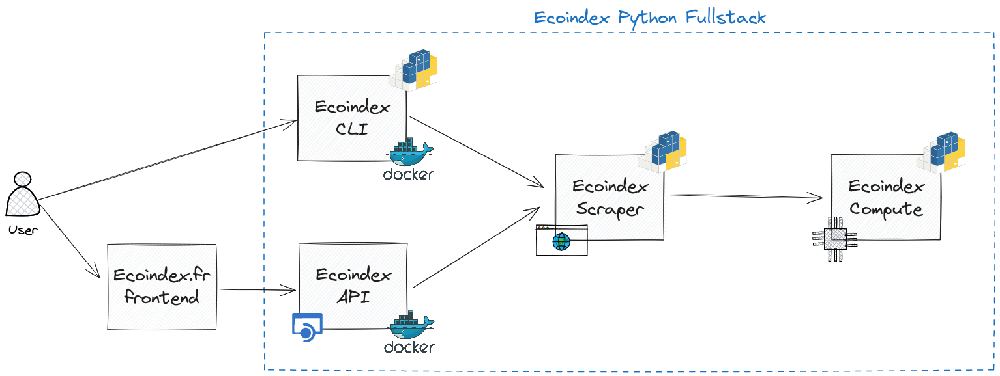

# Ecoindex Python Fullstack

[](https://github.com/cnumr/ecoindex_python_fullstack/actions/workflows/quality_check.yml)


- [Ecoindex Python Fullstack](#ecoindex-python-fullstack)
  - [Projects](#projects)
  - [Getting started](#getting-started)
    - [Requirements](#requirements)
    - [Installation](#installation)
    - [Usage](#usage)
  - [Disclaimer](#disclaimer)
  - [License](#license)
  - [Contributing](#contributing)
  - [Code of conduct](#code-of-conduct)

This project is a polylith repository for the Ecoindex project. It is called "fullstack" because it contains all the components of the project, including the backend that is used in production, but also a CLI tool and modules that can be used in other projects.

You can get more information about polylith in the [official documentation](https://polylith.gitbook.io/polylith) and in the [python-polylith tool](https://github.com/DavidVujic/python-polylith) that is used to manage this repository.

## Projects

This repository contains the following projects:

- [Ecoindex Compute](projects/ecoindex_compute/README.md): this is the base module that provides a simple interface to get the [Ecoindex](http://www.ecoindex.fr) based on 3 parameters:
  - The number of DOM elements in the page
  - The size of the page
  - The number of external requests of the page
- [Ecoindex Scraper](projects/ecoindex_scraper/README.md): This module provides a simple interface to get the [Ecoindex](http://www.ecoindex.fr) based on a URL. It uses [Playwright](https://playwright.dev/) to get the DOM elements, size and requests of the page.
- [Ecoindex CLI](projects/ecoindex_cli/README.md): This module provides a CLI tool to get the [Ecoindex](http://www.ecoindex.fr) based on a URL. It uses the [Ecoindex Scraper](projects/ecoindex_scraper/README.md) module.
- [Ecoindex API](projects/ecoindex_api/README.md): This module provides a REST API to get the [Ecoindex](http://www.ecoindex.fr) based on a URL. It uses the [Ecoindex Scraper](projects/ecoindex_scraper/README.md) module.

Here is a diagram of the dependencies between the projects:



## Getting started

### Requirements

- [Python 3.9+](https://www.python.org/downloads/)
- [Poetry](https://python-poetry.org/docs/#installation)
- [Task](https://taskfile.dev/#/installation)
- [Docker](https://docs.docker.com/get-docker/) (optional)

### Installation

To install main dependencies, run:

```bash
task poetry:install
```

### Usage

Have a look at the task help:

```bash
task --list
```

## Disclaimer

The LCA values used by [ecoindex](https://github.com/cnumr/ecoindex_monorepo) to evaluate environmental impacts are not under free license - ©Frédéric Bordage
Please also refer to the mentions provided in the code files for specifics on the IP regime.

## [License](LICENSE)

## [Contributing](CONTRIBUTING.md)

## [Code of conduct](CODE_OF_CONDUCT.md)