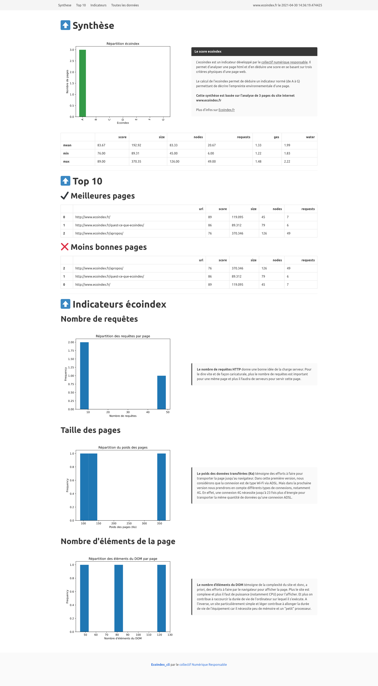

# Ecoindex-Cli

[](https://github.com/cnumr/ecoindex_python_fullstack/actions/workflows/quality_check.yml)


This tool provides an easy way to analyze websites with [Ecoindex](https://www.ecoindex.fr) from your local computer using multi-threading. You have the ability to:

- Make the analysis on multiple pages
- Define multiple screen resolution
- Make a recursive analysis from a given website

This CLI is built on top of [ecoindex-scraper](https://pypi.org/project/ecoindex-scraper/) with [Typer](https://typer.tiangolo.com/)

The output is a CSV or JSON file with the results of the analysis.

## Requirements

- [Docker](https://docs.docker.com/get-docker/) (optional)

## Quickstart

The simplest way to start with ecoindex-cli is to install docker and then create an alias in your .bashrc or .zshrc file:

For MacOS and Windows :

```bash
alias ecoindex-cli="docker run -it --rm -v /tmp/ecoindex-cli:/tmp/ecoindex-cli vvatelot/ecoindex-cli:latest ecoindex-cli"
```

For Linux :

```bash
alias ecoindex-cli="docker run -it --rm --add-host=host.docker.internal:host-gateway -v /tmp/ecoindex-cli:/tmp/ecoindex-cli vvatelot/ecoindex-cli:latest ecoindex-cli"
```

Then you can use the cli as if it was installed on your computer:

```bash
ecoindex-cli --help
```

To enable local testing we use the docker alias `host.docker.internal` to access your machine localhost.
Currently, `host.docker.internal` is mapped to your IPv4 address. To facilitate local testing, ensure that your localhost is accessible via your IPv4 address (127.0.0.1).

## Use case

The docker image [vvatelot/ecoindex-cli](https://hub.docker.com/r/vvatelot/ecoindex-cli) is available for `linux/amd64` and `linux/arm64` platforms and provides you an easy way to use this CLI on your environment.

The one line command to use it is:

```bash
ecoindex-cli analyze --url https://www.ecoindex.fr --recursive --html-report 
```

### Make a simple analysis

You give just one web url

```bash
ecoindex-cli analyze --url https://www.ecoindex.fr
```

<details><summary>Result</summary>

```bash
📁️ Urls recorded in file `/tmp/ecoindex-cli/input/www.ecoindex.fr.csv`
There are 1 url(s), do you want to process? [Y/n]: 
1 urls for 1 window size with 8 maximum workers
100% ━━━━━━━━━━━━━━━━━━━━━━━━━━━━━━━━━━━━━━━━ 1/1 • 0:00:10 • 0:00:00
┏━━━━━━━━━━━━━━━━┳━━━━━━━━━┳━━━━━━━━┓
┃ Total analysis ┃ Success ┃ Failed ┃
┡━━━━━━━━━━━━━━━━╇━━━━━━━━━╇━━━━━━━━┩
│ 1              │ 1       │ 0      │
└────────────────┴─────────┴────────┘
🙌️ File /tmp/ecoindex-cli/output/www.ecoindex.fr/2023-14-04_140013/results.csv written !
```

</details>

> This makes an analysis with a screen resolution of 1920x1080px by default and with the last known version of chromedriver. You can set those settings with options: `--window-size` and `--chrome-version`
> You can add multiple urls to analyze with the option `--url`. For example:

```bash
ecoindex-cli analyze --url https://www.ecoindex.fr --url https://www.ecoindex.fr/a-propos/
```

### Provide urls from a file

You can use a file with given urls that you want to analyze: One url per line. This is helpful if you want to play the same scenario recurrently.

```bash
ecoindex-cli analyze --urls-file input/ecoindex.csv
```

<details><summary>Result</summary>

```bash
📁️ Urls recorded in file `/tmp/ecoindex-cli/input/www.ecoindex.fr.csv`
There are 2 url(s), do you want to process? [Y/n]: 
2 urls for 1 window size with 8 maximum workers
100% ━━━━━━━━━━━━━━━━━━━━━━━━━━━━━━━━━━━━━━━━ 2/2 • 0:00:14 • 0:00:00
┏━━━━━━━━━━━━━━━━┳━━━━━━━━━┳━━━━━━━━┓
┃ Total analysis ┃ Success ┃ Failed ┃
┡━━━━━━━━━━━━━━━━╇━━━━━━━━━╇━━━━━━━━┩
│ 2              │ 2       │ 0      │
└────────────────┴─────────┴────────┘
🙌️ File /tmp/ecoindex-cli/output/www.ecoindex.fr.csv/2023-14-04_140853/results.csv written !
```

</details>

### Make a website analysis based on the website's sitemap

The cli allows for the analysis of a designated website using its sitemap. By entering the sitemap URL, the app identifies and analyzes all pages within the website. ⚠️ This can process for a very long time! **Use it at your own risks!**

```bash
ecoindex-cli analyze --sitemap https://www.ecoindex.fr/sitemap.xml
```

<details><summary>Result</summary>

```bash
You are about to read urls from a website sitemap. This can take a long time. Are you sure to want to proceed? [Y/n]: 
⏲️ Crawling sitemap url https://www.ecoindex.fr/sitemap.xml -> Wait a minute!
2024-02-20 18:38:16 [scrapy.utils.log] INFO: Scrapy 2.11.1 started (bot: scrapybot)
2024-02-20 18:38:16 [scrapy.utils.log] INFO: Versions: lxml 5.1.0.0, libxml2 2.12.3, cssselect 1.2.0, parsel 1.8.1, w3lib 2.1.2, Twisted 23.10.0, Python 3.12.2 (main, Feb 13 2024, 08:34:52) [GCC 12.2.0], pyOpenSSL 24.0.0 (OpenSSL 3.2.1 30 Jan 2024), cryptography 42.0.3, Platform Linux-6.4.16-linuxkit-aarch64-with-glibc2.36
📁️ Urls recorded in file `/tmp/ecoindex-cli/input/www.ecoindex.fr.csv`
There are 22 url(s), do you want to process? [Y/n]: y
22 urls for 1 window size with 10 maximum workers
100% ━━━━━━━━━━━━━━━━━━━━━━━━━━━━━━━━━━━━━━━━ 22/22 • 0:00:20 • 0:00:00
┏━━━━━━━━━━━━━━━━┳━━━━━━━━━┳━━━━━━━━┓
┃ Total analysis ┃ Success ┃ Failed ┃
┡━━━━━━━━━━━━━━━━╇━━━━━━━━━╇━━━━━━━━┩
│ 22             │ 22      │ 0      │
└────────────────┴─────────┴────────┘
🙌️ File /tmp/ecoindex-cli/output/www.ecoindex.fr/2024-02-20_183842/results.csv written !
```

</details>

Note: When utilizing the sitemap method with the --recursive flag, please be aware that the recursive flag will not take effect.

### Make a recursive analysis

You can make a recursive analysis of a given webiste. This means that the app will try to find out all the pages into your website and launch an analysis on all those web pages. ⚠️ This can process for a very long time! **Use it at your own risks!**

```bash
ecoindex-cli analyze --url https://www.ecoindex.fr --recursive
```

<details><summary>Result</summary>

```bash
You are about to perform a recursive website scraping. This can take a long time. Are you sure to want to proceed? [Y/n]: 
⏲️ Crawling root url https://www.ecoindex.fr -> Wait a minute!
-2023-04-14 14:09:38 [scrapy.utils.log] INFO: Scrapy 2.8.0 started (bot: scrapybot)
2023-04-14 14:09:38 [scrapy.utils.log] INFO: Versions: lxml 4.9.2.0, libxml2 2.9.14, cssselect 1.2.0, parsel 1.7.0, w3lib 2.1.1, Twisted 22.10.0, Python 3.11.3 (main, Apr  5 2023, 14:15:06) [GCC 9.4.0], pyOpenSSL 23.0.0 (OpenSSL 3.0.8 7 Feb 2023), cryptography 39.0.2, Platform Linux-5.15.0-67-generic-x86_64-with-glibc2.31
2023-04-14 14:09:38 [scrapy.crawler] INFO: Overridden settings:
{'LOG_ENABLED': False}
📁️ Urls recorded in file `/tmp/ecoindex-cli/input/www.ecoindex.fr.csv`
There are 7 url(s), do you want to process? [Y/n]: 
7 urls for 1 window size with 8 maximum workers
100% ━━━━━━━━━━━━━━━━━━━━━━━━━━━━━━━━━━━━━━━━ 7/7 • 0:00:25 • 0:00:00
┏━━━━━━━━━━━━━━━━┳━━━━━━━━━┳━━━━━━━━┓
┃ Total analysis ┃ Success ┃ Failed ┃
┡━━━━━━━━━━━━━━━━╇━━━━━━━━━╇━━━━━━━━┩
│ 7              │ 7       │ 0      │
└────────────────┴─────────┴────────┘
🙌️ File /tmp/ecoindex-cli/output/www.ecoindex.fr/2023-14-04_141011/results.csv written !
```

</details>

### Generate a html report

You can generate a html report easily at the end of the analysis. You just have to add the option `--html-report`.

```bash
ecoindex-cli analyze --url https://www.ecoindex.fr --recursive --html-report
```

<details><summary>Result</summary>

```bash
You are about to perform a recursive website scraping. This can take a long time. Are you sure to want to proceed? [Y/n]: 
⏲️ Crawling root url https://www.ecoindex.fr -> Wait a minute!
-2023-04-14 14:16:13 [scrapy.utils.log] INFO: Scrapy 2.8.0 started (bot: scrapybot)
2023-04-14 14:16:13 [scrapy.utils.log] INFO: Versions: lxml 4.9.2.0, libxml2 2.9.14, cssselect 1.2.0, parsel 1.7.0, w3lib 2.1.1, Twisted 22.10.0, Python 3.11.3 (main, Apr  5 2023, 14:15:06) [GCC 9.4.0], pyOpenSSL 23.0.0 (OpenSSL 3.0.8 7 Feb 2023), cryptography 39.0.2, Platform Linux-5.15.0-67-generic-x86_64-with-glibc2.31
2023-04-14 14:16:13 [scrapy.crawler] INFO: Overridden settings:
{'LOG_ENABLED': False}
📁️ Urls recorded in file `/tmp/ecoindex-cli/input/www.ecoindex.fr.csv`
There are 7 url(s), do you want to process? [Y/n]: 
7 urls for 1 window size with 8 maximum workers
100% ━━━━━━━━━━━━━━━━━━━━━━━━━━━━━━━━━━━━━━━━ 7/7 • 0:00:28 • 0:00:00
┏━━━━━━━━━━━━━━━━┳━━━━━━━━━┳━━━━━━━━┓
┃ Total analysis ┃ Success ┃ Failed ┃
┡━━━━━━━━━━━━━━━━╇━━━━━━━━━╇━━━━━━━━┩
│ 7              │ 7       │ 0      │
└────────────────┴─────────┴────────┘
🙌️ File /tmp/ecoindex-cli/output/www.ecoindex.fr/2023-14-04_141645/results.csv written !
🦄️ Amazing! A report has been generated to /tmp/ecoindex-cli/output/www.ecoindex.fr/2023-14-04_141645/index.html
```

</details>

> When generating a html report, the results are written in a CSV file and you can not specify the result file location. So options `--export-format` and `--output-file` are ignored.

Here is a sample result:


### Other features

#### Set the output file

You can define the csv output file

```bash
ecoindex-cli analyze --url https://www.ecoindex.fr --output-file ~/ecoindex-results/ecoindex.csv
```

#### Export to JSON file

By default, the results are exported to a CSV file. But, you can specify to export the results to a JSON file.

```bash
ecoindex-cli analyze --url https://www.ecoindex.fr --export-format json
```

### Change wait before / after scroll

By default, the scenario waits 3 seconds before and after scrolling to bottom of the page so that the analysis results are conform to the Ecoindex main API methodology.

You can change this value with the option `--wait-before-scroll` and `--wait-after-scroll` to fit your needs.

```bash
ecoindex-cli analyze --url https://www.ecoindex.fr --wait-before-scroll 1 --wait-after-scroll 1
```

### Using multi-threading

You can use multi-threading to speed up the analysis when you have a lot of websites to analyze. In this case, you can define the maximum number of workers to use:

```bash
ecoindex-cli analyze --url https://www.ecoindex.fr --url https://www.greenit.fr/ --max-workers 10
```

> By default, the number of maximum workers is set to CPU count.

### Disable console interaction

You can disable confirmations, and force the app to answer yes to all of them. It can be useful if you need to start the app from another script, or if you have no time to wait it to finish.

```bash
ecoindex-cli analyze --url https://www.ecoindex.fr --recursive --no-interaction
```

### Only generate a report from existing result file

If you already performed an anlayzis and (for example), forgot to generate the html report, you do not need to re-run a full analyzis, you can simply request a report from your result file :

```bash
ecoindex-cli report "/tmp/ecoindex-cli/output/www.ecoindex.fr/2021-05-06_191355/results.csv" "www.synchrone.fr"
```

<details><summary>Result</summary>

```bash
🦄️ Amazing! A report has been generated to /tmp/ecoindex-cli/output/www.ecoindex.fr/2021-05-06_191355/index.html
```

</details>

## Results example

The result of the analysis is a CSV or JSON file which can be easily used for further analysis:

### CSV example

```csv
width,height,url,size,nodes,requests,grade,score,ges,water,date,page_type
1920,1080,https://www.ecoindex.fr,521.54,45,68,B,75.0,1.5,2.25,2022-05-03 22:28:49.280479,
1920,1080,https://www.greenit.fr,1374.641,666,167,E,32.0,2.36,3.54,2022-05-03 22:28:51.176216,website
```

### JSON example

```json
[
    {
        "width": 1920,
        "height": 1080,
        "url": "https://www.ecoindex.fr",
        "size": 521.54,
        "nodes": 45,
        "requests": 68,
        "grade": "B",
        "score": 75.0,
        "ges": 1.5,
        "water": 2.25,
        "date": "2022-05-03 22:25:01.016749",
        "page_type": null
    },
    {
        "width": 1920,
        "height": 1080,
        "url": "https://www.greenit.fr",
        "size": 1163.386,
        "nodes": 666,
        "requests": 148,
        "grade": "E",
        "score": 34.0,
        "ges": 2.32,
        "water": 3.48,
        "date": "2022-05-03 22:25:04.516676",
        "page_type": "website"
    }
]
```

### Fields description

- `width` is the screen width used for the page analysis (in pixels)
- `height` is the screen height used for the page analysis (in pixels)
- `url` is the analysed page url
- `size` is the size of the page and of the downloaded elements of the page in KB
- `nodes` is the number of the DOM elements in the page
- `requests` is the number of external requests made by the page
- `grade` is the corresponding ecoindex grade of the page (from A to G)
- `score` is the corresponding ecoindex score of the page (0 to 100)
- `ges` is the equivalent of greenhouse gases emission (in `gCO2e`) of the page
- `water`is the equivalent water consumption (in `cl`) of the page
- `date` is the datetime of the page analysis
- `page_type` is the type of the page, based ton the [opengraph type tag](https://ogp.me/#types)

## Development

### Requirements

- Python 3.10+
- [Poetry](https://python-poetry.org/)
- [Task](https://taskfile.dev/#/installation)

### Installation

At first, you need to install dependencies:

```bash
poetry install
poetry run playwright install chromium --with-deps
```

### Usage

```bash
poetry run ecoindex-cli --help
poetry run ecoindex-cli analyze --help
poetry run ecoindex-cli report --help
```

### Testing

We use Pytest to run unit tests for this project. The test suite are in the `tests` folder. Just execute :

```bash
poetry run pytest --cov-report term-missing:skip-covered --cov=. --cov-config=.coveragerc tests
```

> This runs pytest and also generate a [coverage report](https://pytest-cov.readthedocs.io/en/latest/) (terminal and html)
